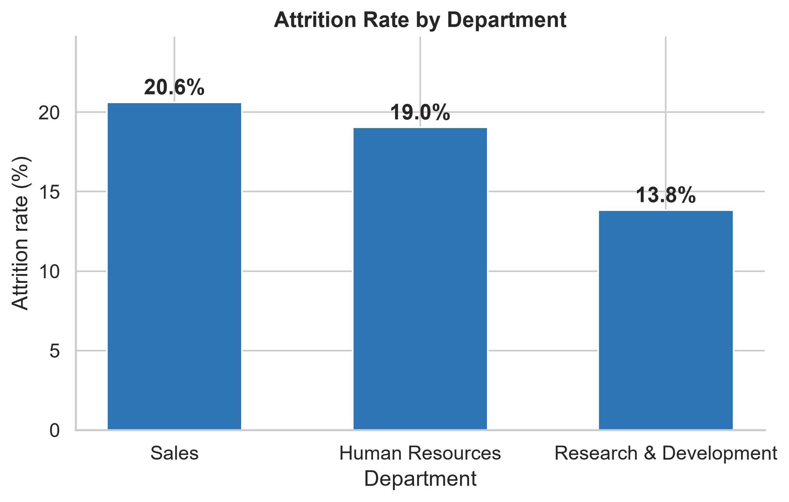
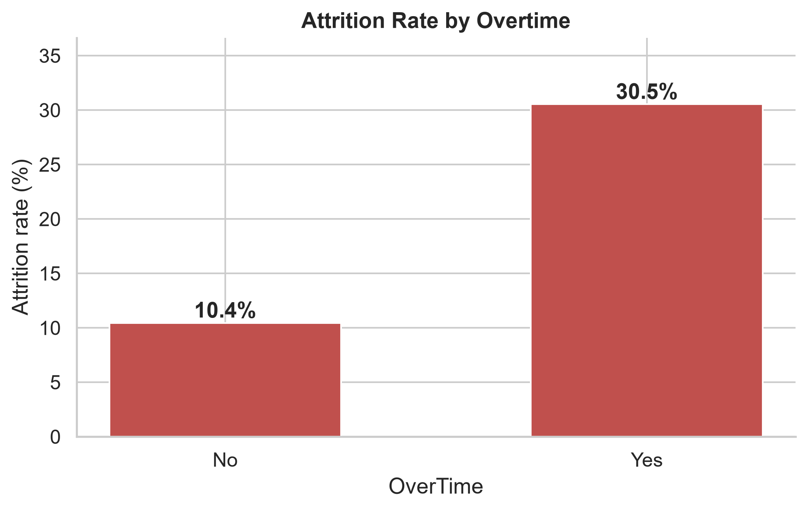
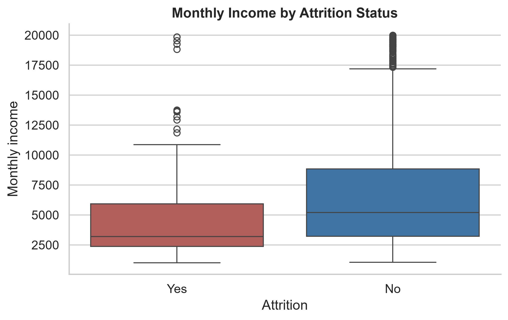
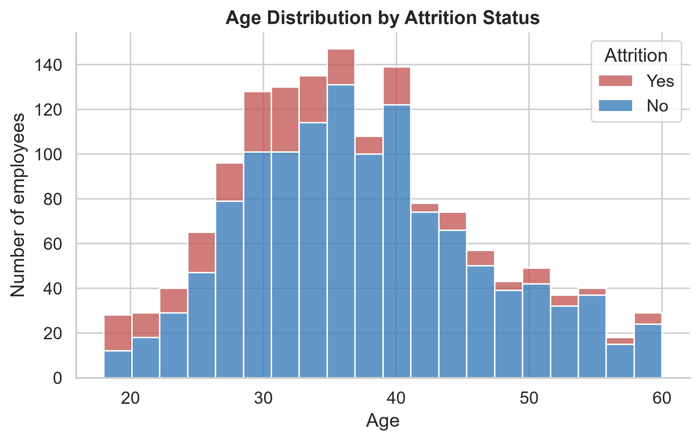
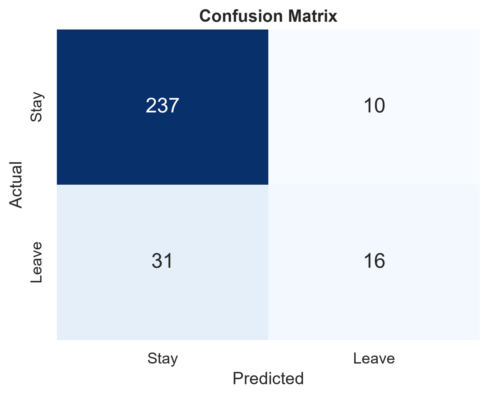
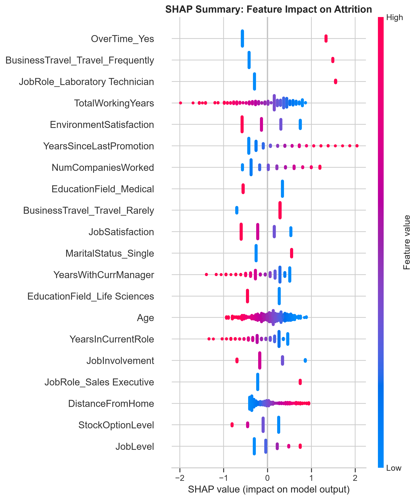

# HR Analytics: Predicting Employee Attrition

Exploratory analysis and machine learning on the IBM HR Analytics dataset to find why employees leave and to predict who is likely to resign.

   

## Project Overview

Employee attrition is costly because hiring and training replacements takes time and money. This project analyses **1,470 employee records** to:

1. Show how attrition varies by department, overtime, income and age.
2. Train a model that predicts whether an employee will leave.
3. Explain which factors drive the predictions, using SHAP.

## Key Results

| Metric | Value |
|---|---|
| Employees analysed | 1,470 |
| Overall attrition rate | 16% |
| Model | Logistic Regression |
| Test accuracy | 86% |
| Recall for leavers | 0.34 |
| Precision for leavers | 0.62 |

> **Honest takeaway:** the data is imbalanced (only 16% leavers), so accuracy alone looks better than the model really is. The model finds about 1 in 3 real leavers. Balancing the classes is the main next step.

## Key Insights

- **Overtime is the strongest signal.** 30.5% of employees working overtime leave, compared with 10.4% of those who do not.
- **Department matters.** Attrition is highest in Sales (20.6%) and Human Resources (19.0%), and lowest in Research & Development (13.8%).
- **Pay and age.** Leavers have lower monthly income (median about 3,200 vs about 5,200) and are mostly in their 20s and 30s.
- **SHAP drivers.** Overtime, frequent business travel, fewer total working years and long gaps since the last promotion push predictions towards leaving.

## Charts

### Attrition by department


### Attrition by overtime


### Monthly income vs attrition


### Age vs attrition


### Confusion matrix


### SHAP feature impact


## Methodology

1. **Load and check** the data with pandas (missing values, data types).
2. **Explore** attrition by department, overtime, income and age.
3. **Prepare** the data: one-hot encode categorical columns and scale numeric features.
4. **Split** into 1,176 training and 294 test records (80/20).
5. **Train** a Logistic Regression model (`max_iter=1000`).
6. **Evaluate** with accuracy, precision, recall, F1-score and a confusion matrix.
7. **Explain** the model with SHAP values.
8. **Export** a cleaned file for a Power BI dashboard.

## Repository Contents

| File | Description |
|---|---|
| `attrition_analysis.ipynb` | Full analysis and model (Jupyter Notebook) |
| `WA_Fn-UseC_-HR-Employee-Attrition.csv` | Original IBM HR Analytics dataset |
| `hr_data_for_powerbi.csv` | Cleaned data used for the Power BI dashboard |
| `chart1_department.png` to `chart6_shap.png` | Charts used in the report |
| `HR_Attrition_Report.pdf` | Full project report |

## How to Run

```bash
git clone https://github.com/DILSHA-A/hr-attrition-project.git
cd hr-attrition-project
pip install pandas numpy matplotlib seaborn scikit-learn shap jupyter
jupyter notebook attrition_analysis.ipynb
```

## Limitations and Next Steps

- Improve recall for leavers with SMOTE, class weights or oversampling.
- Tune the decision threshold to trade some precision for higher recall.
- Compare Random Forest and Gradient Boosting using cross-validation.
- The dataset is a single snapshot, so results show association, not cause.

## Recommendations for HR

- Review workloads for employees who regularly work overtime.
- Check pay for lower-income and early-career staff.
- Build clear promotion paths.
- Focus retention efforts on Sales, HR and younger employees.

## Author

**Dilsha A**
GitHub: [DILSHA-A](https://github.com/DILSHA-A)

## Dataset Source

IBM HR Analytics Employee Attrition & Performance dataset (publicly available, fictional data created by IBM data scientists).
